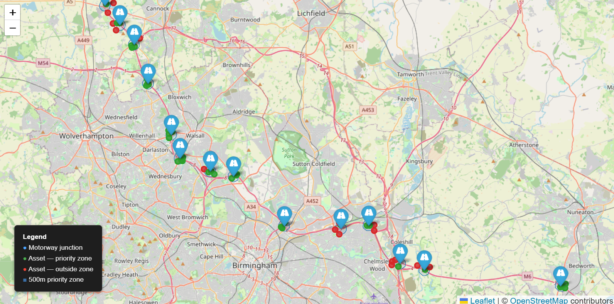

# UK Motorway Asset Density & Maintenance Priority Mapper

An interactive GIS project that maps real M1 and M6 motorway junctions near Birmingham and Nottingham, builds maintenance priority zones around them, and runs a spatial join against a set of simulated roadside assets to flag which ones fall within priority range.

Built to demonstrate practical GIS mapping and spatial analysis skills: coordinate reference systems, buffering, and spatial joins, using Python, GeoPandas, Shapely, and Folium.

**Live app:** https://uk-motorway-asset-mapper.streamlit.app/



## What this project does

1. Fetches real M1 and M6 junction locations live from OpenStreetMap via the Overpass API
2. Builds a maintenance priority zone (adjustable radius, default 500m) around each junction, using proper coordinate reprojection so the distance is accurate on the ground
3. Scatters a set of simulated roadside assets (gantries, safety barriers, signage) near each junction
4. Runs a spatial join to work out which assets fall inside a priority zone
5. Renders everything on an interactive Folium map, wrapped in a Streamlit app with an adjustable zone radius slider

## Data sources — what's real and what's simulated

**Real:** Motorway junction locations for the M1 and M6 are fetched live from [OpenStreetMap](https://www.openstreetmap.org/copyright) via the [Overpass API](https://wiki.openstreetmap.org/wiki/Overpass_API). These are genuine, community-mapped junction locations, not hand-typed or invented. OpenStreetMap is a real, actively maintained public geodata source used in production tools worldwide, but it is not an official National Highways dataset, and coordinates should be treated as good approximations rather than survey-grade.

**Simulated:** Roadside assets (gantries, safety barriers, signage) are entirely fictional, generated by scattering points at a random distance and direction from each junction. This data does **not** come from National Highways and does not represent real asset locations. It exists purely to demonstrate the spatial join technique. This is stated clearly in the app itself as well as here.

A small number of OpenStreetMap junction nodes had no assigned junction number (usually minor slip-road nodes) and were excluded from the final dataset, since they wouldn't correspond to a named junction a driver would recognise.

## GIS techniques demonstrated

- **Coordinate Reference Systems (CRS):** junctions are supplied in WGS84 (degrees), reprojected to British National Grid (EPSG:27700, a metres-based UK grid) for accurate distance-based operations, then reprojected back to WGS84 for mapping.
- **Buffering:** each junction is expanded into a circular polygon representing its priority zone, using a real metric distance rather than an approximated degree-based radius.
- **Spatial joins:** `geopandas.sjoin()` is used to test whether each asset point falls within a priority zone polygon, the analytical core of the project.
- **GeoDataFrames:** all spatial data is handled as GeoDataFrames throughout, keeping geometry, CRS, and attribute data together.
- **Data cleaning:** duplicate junction nodes (multiple slip roads sharing one junction number) are collapsed to a single representative point using a centroid-style aggregation.

## Tech stack

- Python
- GeoPandas / Shapely — spatial data and geometry
- Folium — interactive map rendering
- Streamlit + streamlit-folium — interactive web app, deployed on Streamlit Community Cloud
- Requests — Overpass API access
- Pandas

## Project structure

```
uk-motorway-asset-mapper/
├── README.md
├── requirements.txt
├── app.py                        # Streamlit app
├── data/
│   ├── junctions.csv             # real, fetched from OpenStreetMap
│   ├── assets.csv                # simulated
│   └── assets_with_priority.csv  # spatial join output
├── src/
│   ├── fetch_junctions.py        # pulls real junction data from Overpass API
│   ├── generate_assets.py        # generates simulated assets
│   ├── build_zones.py            # CRS reprojection + buffering
│   ├── spatial_analysis.py       # spatial join
│   └── build_map.py              # Folium map construction
├── output/
│   └── priority_map.html         # standalone map export
└── docs/
    └── screenshot.png
```

## Running it locally

```bash
git clone https://github.com/danielakbank/uk-motorway-asset-mapper.git
cd uk-motorway-asset-mapper
python -m venv venv
venv\Scripts\activate        # Windows
# source venv/bin/activate   # Mac/Linux

pip install -r requirements.txt

python src/fetch_junctions.py
python src/generate_assets.py
python src/spatial_analysis.py

streamlit run app.py
```

This opens the interactive app in your browser. You can also generate a standalone HTML map with `python src/build_map.py`, saved to `output/priority_map.html`.

## Known limitations

- Junction coordinates come from OpenStreetMap, which is community-maintained. Tagging is generally reliable for major junctions but can be inconsistent for minor slip roads.
- The M1 and M6 meet near Catthorpe, and OpenStreetMap tags this interchange slightly differently depending on which motorway's data you query, so it can appear more than once in the raw data.
- Asset data is entirely simulated and should never be treated as a real infrastructure dataset.
